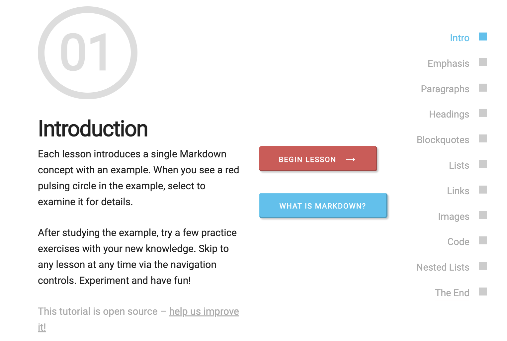

```{r setup, include=FALSE}
options(htmltools.dir.version = FALSE)
episode_counter <- 0
knitr::opts_chunk$set(
  collapse = TRUE,   
  comment = "#>"
)
```

```{r packages, include=FALSE}

library(arsenal)
library(countdown)
library(gt)
library(janitor)
library(knitr)
library(memer)
library(quarto)
library(survival)
library(tidyverse)
library(ymlthis)


ggplot2::theme_set(ggplot2::theme_minimal())
```

```{r load-data, include=FALSE}
mockdata = lung %>% 
  mutate_at(.vars = c("inst", "status", "sex", "ph.ecog"),.funs = as.factor)
```


class: title-slide, center, bottom

## `r rmarkdown::metadata$title`
  
.pull-left[
#### `r rmarkdown::metadata$author` &#183; Data Science Institute

######  All content is [RStudio Education](https://github.com/rstudio-education/rmd4medicine), CC-BY. All art (unless otherwise noted) is by [Desirée De Leon](https://desiree.rbind.io/) and [Allison Horst](https://www.allisonhorst.com/), CC-BY-NC-ND.
]

---
# Getting Started (`r emo::ji("vertical_traffic_light")`)

- My background
- Introductions in the HackMD
- Double check downloads
- Tour of R Studio IDE
- Download packages

---

# What is Quarto?

1. ["An authoring framework for data science."](https://quarto.org/docs/guide/) (`r emo::ji("heavy_check_mark")`)

1. [A document format (`.qmd`).](https://quarto.org/) (`r emo::ji("heavy_check_mark")`)

1. ["A file format for making dynamic documents that contain code written in Python, R, Julia, or Observable."](https://community.rstudio.com/t/i-use-like-r-markdown-why-should-i-try-out-quarto/133752) (`r emo::ji("heavy_check_mark")`)

1. ["A tool for converting between `.qmd` and `.ipynb`."](https://blog.ouseful.info/2021/09/07/a-quick-look-at-the-quarto-pandoc-publishing-system-and-visual-markdown-editor/) (`r emo::ji("heavy_check_mark")`)

1. ["A computational document."](https://www.apreshill.com/blog/2022-04-we-dont-talk-about-quarto/) (`r emo::ji("heavy_check_mark")`)

1. Wizardry. (`r emo::ji("witch")`)


---
background-image: url(https://r3-rmedicine.netlify.app/slides/images/quarto-how.png)
background-size: 102%
background-position: bottom

# How does Quarto work?


---
background-image: url(images/Pandoc_magic.jpeg)
background-position: bottom
background-size: 30%

# How *does* Quarto work?


1. `r emo::ji("shrug")` (`r emo::ji("heavy_check_mark")`)

1. I press render, a document appears, and I believe that anything happening in between could be actual magic.(`r emo::ji("wizard")`)

1. `knitr` or `jupyter` executes the code and converts to `.md`; **Pandoc** renders the `.md` file to the output format you want. (`r emo::ji("heavy_check_mark")`)


---
class: middle, center

# Change your mental model

.pull-left1[

### Source &harr; output

```{r echo=FALSE, out.width="50%"}
knitr::include_graphics("images/haba-elise.jpg")
```

]

.pull-right1[

### Source &rarr; output

```{r echo=FALSE, out.width="50%"}

```

]


---
background-image: url(images/reproducibility_dolls.png)
background-size: cover
class: top, center

.footnote1[https://www.americangirl.com/shop/c/welliewishers]

---
class: middle, inverse, center

# Same ~~doll~~ source

# Different occasions


---
class: your-turn

# First look

Explore `index.qmd`. 
Look at the source, then `r emo::ji("right_arrow")` **Render** to HTML.

Try to identify these parts in the source and the output:

1. The **metadata**

1. The **text** 

1. The **code**

1. The **output**

**If this was easy**, try to identify global code chunk options!


```{r echo = FALSE}
countdown(minutes = 2)
```


???

need to fix this challenge question

---
class: center, middle

```{r do-live, echo=FALSE, out.width="90%"}
knitr::include_graphics("images/doc-live.jpg")
```


---
class: middle, center, inverse

<span class="fa-stack fa-4x">
  <i class="fa fa-circle fa-stack-2x" style="color: #fff;"></i>
  <strong class="fa-stack-1x" style="color:#2f5275;">`r (episode_counter <- episode_counter + 1)` </strong>
</span> 

# Metadata

---

# metadata: YAML

.pull-left1[

_"YAML Ain't Markup Language"_


```yaml
---
key: value
---
```

- Save output options in your YAML
  - `format: html`
  - two values for the key `execute` 
]

.pull-right1[

```{r echo=FALSE, out.width="75%", fig.align='center'}
knitr::include_graphics("images/orchestra.jpg")
```

]


---
class: your-turn

# Your turn

## Edit your YAML

Use **https://quarto.org/docs/output-formats/html-basics.html** to:

1. Update the author 

1. Add a table of contents

1. Add the theme `spacelab`

`r emo::ji("right_arrow")` **Render** to HTML to see the output.

**If this was easy**, store the intermediary `.md` file! 


```{r echo = FALSE}
countdown(minutes = 2)
```

???

answers: 

format: 
  html:
    keep-md: true
    toc: true
    theme: spacelab

---


# What is hard about YAML?

+ Indentations matter

+ Rarely informative error messages

+ Knowing which output options are relevant for different formats (i.e., Word, PDF, HTML, etc.)

+ Easy to forget the right `key`

+ Easy to forget the possible `values` for a given `key`

+ Quarto is annoyingly different from R Markdown


---
class: inverse, center, middle

<span class="fa-stack fa-4x">
  <i class="fa fa-circle fa-stack-2x" style="color: #fff;"></i>
  <strong class="fa-stack-1x" style="color:#2f5275;">`r (episode_counter <- episode_counter + 1)` </strong>
</span> 

# Markdown Text

---
name: 03-formative
class: middle

# Pop quiz

--

.pull-left1[

How do you add lists in Markdown? Bulleted? Numbered?

`! Item 1`

`- Item 1`

`# Item 1`

`1. Item 1`

]

--

.pull-right1[

```{r echo=FALSE, out.width="95%", fig.align='left'}

```
https://commonmark.org/help/tutorial/
]

---
class: inverse, center, middle

<span class="fa-stack fa-4x">
  <i class="fa fa-circle fa-stack-2x" style="color: #fff;"></i>
  <strong class="fa-stack-1x" style="color:#2f5275;">`r (episode_counter <- episode_counter + 1)` </strong>
</span> 

# Code


---

#  Chunk labels


````
```{r}`r ''`
#|: label: peek
#| echo: false
#| include: false

glimpse(mockdata)
```
````

+ Set with `#| label: peek` 

+ Separated options with a new line

+ Careful! No duplicate chunk labels


---
background-image: url(images/pour.jpeg)
background-position: left
background-size: contain
class: middle, center

.pull-right[

]

---
#  The setup chunk

.pull-left1[

````
```{r}`r ''`
#| label: setup
#| include: false

knitr::opts_chunk$set(
  collapse = TRUE,   
  comment = "#>", 
  out.width = "100%" 
)
```
````

]

.pull-right1[

+ A special chunk label: `setup`

+ Typically the first chunk

+ All following R-chunks will use these options (i.e., sets global chunk options)

+ **Tip**: set `include: false`

+ You can (and should) use individual chunk options too

]

---
# Code
## R

```{r echo=FALSE, fig.align='center'}
meme_get("DistractedBf") %>% 
  meme_text_distbf("Quarto", "Researchers", "Rmd")
```

---
# Code
## Python

With [`python3`](https://www.python.org/downloads/) and the `jupyter` package installed...Quarto can render 
- python code within a `.qmd`
- any Jupyter notebook (.ipynb)

Use `quarto render document.ipynb` at the command line! 

---
background-image: url(images/ijulialogo.png)
background-position: bottom
background-size: 50%

# Cide
## Julia

- In order to render documents with embedded Julia code you’ll need to install the following components:

  - Jupyter
  - IJulia
  - Revise.jl

---
# Code
## Observable

- **Observable** = Bar of toppings `r emo::ji("chocolate_bar")` options where **Java Script** = Vanilla ice cream `r emo::ji("ice_cream")`
- Create and publish (and steal) observable resources on the hub @ https://observablehq.com/
- Add your code to an {ojs} executable code block
- Interactivity!
  - Add to help readers explore more deeply 
  - not the only option...
    - shiny, html widgets, jupyter widgets


---
class: your-turn

# Your turn `r emo::ji("newspaper")`

Data from more sites just came in &mdash; we now have data for 18 study sites and need to update our report.

1. Replace `lungdat_v1.csv` with `lungdat_v2.csv` in the file `index.qmd`.  `r emo::ji("shushing_face")` *hint* x2! 

1. `r emo::ji("right_arrow")` **Render** to HTML. Do you see data for all sites?

**If this was easy**, and you have `jupyter` installed, try outputting to `.ipynb` format!


```{r echo = FALSE}
countdown(minutes = 2)
```

???

format: ipynb ?


---
class: middle, center, inverse

<span class="fa-stack fa-4x">
  <i class="fa fa-circle fa-stack-2x" style="color: #fff;"></i>
  <strong class="fa-stack-1x" style="color:#2f5275;">!</strong>
</span> 


# More 


---
# Editors

## Jupyter Lab

- you’ll always run `quarto preview` at the command line first to setup a live preview of changes
- in jupyter notebook use `quarto preview document.ipynb` to preview a live version of your document

---
# Editors 
## R Studio (v2022.02)

- Add chunks
  - button
  - Command (or Cmd) `⌘` + Option (or Alt) `⌥` +  `i` (Mac)
  - Ctrl + Alt + `i` (Windows/Linux)
- Run chunks
  - interactively (show button)  
  - whole doc (knit button or run all chunks)
- can use even if target engine is jupyter! Add kernel to YAML

---
# Editors
## VS Code

Benefits: 

- Integrated render and preview for Quarto documents
- Syntax highlighting for markdown and embedded languages
- Completion and diagnostics for YAML options
- Completion for embedded languages (e.g. Python, R, Julia, etc.)
- Commands and key-bindings for running cells and selected lines.
- Live preview for LaTeX math as well as Mermaid and Graphviz diagrams


---
background-image: url(images/rproj.png)
background-size: contain
background-position: right

# Quarto Project


---
background-image: url(images/rmd-quarto.jpg)
background-size: contain
background-position: right

# Extensions

- Books
- Websites


---
class: middle, center, inverse

<span class="fa-stack fa-4x">
  <i class="fa fa-circle fa-stack-2x" style="color: #fff;"></i>
  <strong class="fa-stack-1x" style="color:#2f5275;">!</strong>
</span> 


#  `r emo::ji("envelope_with_arrow")`

---
# Sharing

- Render and release! 
  - (if it renders, it's safe to send)
- Upload your whole directory into [netlify drop](https://app.netlify.com/drop) to share (a doc, a website, a book, anything!) in ~30 seconds


---

# Take-aways


`r emo::ji("heavy_check_mark")` **Document your document:** use YAML to set up meaningful metadata and to add options to your chosen output format

`r emo::ji("heavy_check_mark")` **Organize your text:** use headers with `#` and add tables, links, figures, special characters, and more in markdown.

`r emo::ji("heavy_check_mark")` `r emo::ji("right_arrow")` render early, `r emo::ji("right_arrow")` render often

`r emo::ji("heavy_check_mark")` **Html is easier to render (and customize) than pdf**  
because you dont need to go through tinytex you can "get away" with html reports do that!

  - **When you *do* get tinytex errors, start stripping down your document until you find the problem part**  


---
class: middle, center

# `r emo::ji("stopwatch")`

## TYSM


???

please head to the business meeting
would love to see you at hacky hour later
